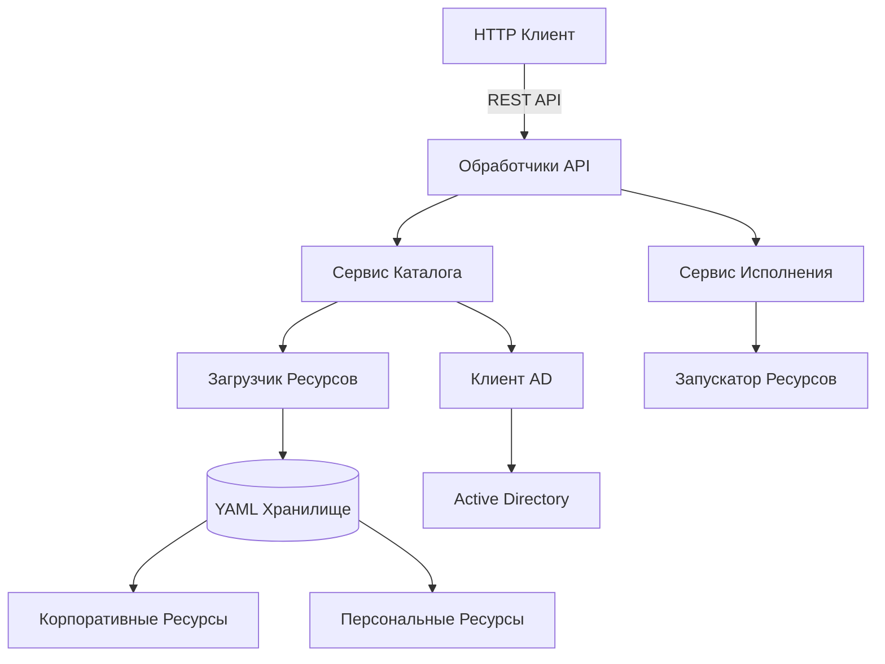

# 🚀 Catalog Agent

<div align="center">


**Корпоративный Windows-агент для управления каталогом ресурсов**

[Особенности](#-особенности) • [Быстрый старт](#-быстрый-старт) • [Архитектура](#-архитектура) • [API](#-api) • [Настройка](#-настройка) • [Лицензия](#-лицензия)

</div>

---

## 📋 Обзор

**Catalog Agent** — это легковесный, высокопроизводительный Windows-сервис, обеспечивающий централизованное управление корпоративными ресурсами с интеграцией с Active Directory. Обеспечивает бесшовный доступ к приложениям, веб-сервисам, папкам и файлам с детальным контролем доступа на основе групп AD.

### ✨ Ключевые преимущества

- 🎯 **Единый источник истины** — Централизованный каталог ресурсов с автоматической синхронизацией
- 🔐 **Корпоративная безопасность** — Контроль доступа на основе групп Active Directory
- 🚀 **Высокая производительность** — Кэшированный каталог с временем ответа менее секунды
- 💾 **Автономный режим** — Работает даже при отсутствии сети
- 📦 **Простая настройка** — Конфигурация через YAML-файлы
- 🔄 **Горячая перезагрузка** — Обновление конфигурации без перезапуска сервиса

---

## 🎯 Возможности

### Основной функционал

| Возможность | Описание |
|-------------|----------|
| **Корпоративные ресурсы** | Централизованное управление общедоступными ресурсами компании |
| **Персональные ресурсы** | Пользовательские ресурсы с локальным сохранением |
| **Интеграция с AD** | Контроль доступа на основе групп с автоматическим определением пользователя |
| **Типы ресурсов** | Приложения, Веб-ссылки, Папки, Файлы |
| **Проверка доступности** | Автоматическая проверка доступности всех ресурсов |
| **Запуск ресурсов** | Запуск приложений, открытие URL, папок и файлов |
| **Извлечение иконок** | Автоматическое извлечение иконок из exe и favicon |
| **Структурированное логирование** | Полный аудит с несколькими уровнями логирования |
| **Кэширование** | Интеллектуальное кэширование для оптимальной производительности |

### Технические особенности

- ✅ **Чистая архитектура** — Разделение ответственности для удобства поддержки
- ✅ **Принципы SOLID** — Модульный, расширяемый дизайн
- ✅ **Внедрение зависимостей** — Слабая связанность и тестируемость
- ✅ **Паттерн Репозиторий** — Чистая абстракция доступа к данным
- ✅ **Windows Service** — Нативная интеграция с Windows
- ✅ **RESTful API** — Простой, интуитивный HTTP-интерфейс

---

## 🚀 Быстрый старт

### Требования

```bash
# Go 1.21 или выше
go version

# Windows, Linux или macOS
```

### Установка

```bash
# Клонирование репозитория
git clone https://github.com/kainzeyg/catalog-agent.git
cd catalog-agent

# Установка зависимостей
go mod download

# Сборка приложения
go build -o catalog-agent main.go

# Запуск
./catalog-agent -config configs/config.yaml
```

### Установка как Windows Service

```powershell
# Установка сервиса
sc create "CatalogAgent" binPath= "C:\path\to\catalog-agent.exe" start= auto

# Запуск сервиса
sc start "CatalogAgent"

# Остановка сервиса
sc stop "CatalogAgent"

# Удаление сервиса
sc delete "CatalogAgent"
```

---

## 📁 Архитектура



### Структура проекта

```
catalog-agent/
├── main.go                 # Точка входа в приложение
├── models/                 # Модели данных
│   ├── apiModels.go        # Модели API запросов/ответов
│   ├── userData.go         # Модели данных пользователя
│   ├── corporateResources.go # Модели корпоративных ресурсов
│   └── personalResources.go  # Модели персональных ресурсов
├── handlers/               # HTTP обработчики
│   ├── getUserCatalog.go   # Получение каталога
│   ├── addPersonalResource.go # Добавление ресурса
│   ├── deletePersonalResource.go # Удаление ресурса
│   └── executeResource.go  # Выполнение ресурса
├── entities/               # Бизнес-сущности
│   ├── resourcesData.go    # Сущности ресурсов
│   ├── activeDirectoryData.go # Сущности AD
│   └── filteredCatalogData.go # Отфильтрованный каталог
├── executor/               # Исполнение ресурсов
│   └── execResource.go     # Запускатор ресурсов
├── audit/                  # Логирование
│   └── logger.go          # Структурированный логгер
└── configs/               # Конфигурация
    ├── config.yaml        # Основная конфигурация
    ├── corporateResources.yaml # Корпоративные ресурсы
    └── personalResources.yaml  # Персональные ресурсы
```

---

## 🔌 API

### Эндпоинты

| Метод | Эндпоинт | Описание | Тело запроса |
|-------|----------|----------|--------------|
| `POST` | `/catalog` | Получение каталога пользователя | `{"user": "user@domain.com"}` |
| `POST` | `/execute` | Выполнение ресурса | `{"resourceId": "resource_id"}` |
| `POST` | `/personal/add` | Добавление персонального ресурса | Объект ресурса |
| `DELETE` | `/personal/delete` | Удаление персонального ресурса | `{"resourceId": "resource_id"}` |
| `GET` | `/health` | Проверка состояния | - |

### Примеры запросов

#### Получение каталога
```bash
curl -X POST http://localhost:8080/catalog \
  -H "Content-Type: application/json" \
  -d '{"user": "ivan.ivanov@company.com"}'
```

#### Выполнение ресурса
```bash
curl -X POST http://localhost:8080/execute \
  -H "Content-Type: application/json" \
  -d '{"resourceId": "visual_studio_2022"}'
```

#### Добавление персонального ресурса
```bash
curl -X POST http://localhost:8080/personal/add \
  -H "Content-Type: application/json" \
  -d '{
    "id": "my_script",
    "name": "Мой скрипт автоматизации",
    "type": "file",
    "description": "Личный скрипт автоматизации",
    "contexts": ["personal"],
    "launch": {
      "path": "C:\\Users\\ivan\\scripts\\automation.ps1"
    }
  }'
```

#### Удаление персонального ресурса
```bash
curl -X DELETE http://localhost:8080/personal/delete \
  -H "Content-Type: application/json" \
  -d '{"resourceId": "my_script"}'
```

---

## ⚙️ Настройка

### config.yaml

```yaml
apiPort: 8080                          # Порт HTTP сервера
scanInterval: 300s                     # Интервал сканирования ресурсов
healthInterval: 60s                    # Интервал проверки доступности
configReloadInterval: 30s              # Интервал перезагрузки конфигурации
logLevel: INFO                         # Уровень логирования (DEBUG, INFO, WARN, ERROR)
serverUrl: http://localhost:8080      # URL сервера

ldap:
  server: ldap.company.com             # LDAP сервер
  port: 636                            # LDAP порт (636 для LDAPS)
  baseDN: "DC=company,DC=com"          # Базовый DN
  bindUser: "CN=Service Account,..."   # Сервисная учетная запись
  bindPass: "secure_password"          # Пароль
  timeout: 10s                         # Таймаут подключения
  enabled: true                        # Включить/отключить AD

storage:
  corporateResources: "configs/corporateResources.yaml"
  personalResources: "configs/personalResources.yaml"
```

### corporateResources.yaml

```yaml
contexts:
  - id: "development"
    name: "Средства разработки"
    description: "Инструменты для разработки и программирования"
    resources:
      - id: "visual_studio_2022"
        name: "Visual Studio 2022"
        type: application
        description: "Среда разработки для .NET"
        contexts: ["development"]
        accessGroups: ["DevTeam", "Architects", "Developers"]
        instructionUrl: "https://docs.company.com/vs"
        launch:
          executable: "C:\\Program Files\\Microsoft Visual Studio\\2022\\Community\\Common7\\IDE\\devenv.exe"
          args: ["/nosplash"]
      
      - id: "jira"
        name: "JIRA"
        type: web
        description: "Управление проектами и отслеживание задач"
        contexts: ["business"]
        accessGroups: ["ProjectManagers", "Developers"]
        launch:
          url: "https://jira.company.com"
```

---

## 📊 Логирование

Структурированное логирование с несколькими уровнями:

```bash
# Просмотр логов
tail -f logs/agent.log

# Пример записи в логе
[INFO] 2024-01-15 14:30:25.123 | main.go:45 main() | Сервер запущен на порту 8080
[INFO] 2024-01-15 14:30:30.456 | handlers/getUserCatalog.go:32 GetUserCatalog() | Запрос каталога для пользователя: ivan.ivanov@company.com
```

### Уровни логирования

| Уровень | Описание |
|---------|----------|
| **DEBUG** | Детальная отладочная информация |
| **INFO** | Основной поток работы приложения |
| **WARN** | Некритичные проблемы |
| **ERROR** | Критические ошибки |

---

## 🛠️ Разработка

### Требования для разработки

```bash
# Установка инструментов разработки
go install github.com/golangci/golangci-lint/cmd/golangci-lint@latest
go install honnef.co/go/tools/cmd/staticcheck@latest
```

### Команды

```bash
# Запуск тестов
go test -v ./...

# Запуск линтера
golangci-lint run

# Форматирование кода
go fmt ./...

# Сборка
go build -o catalog-agent main.go

# Запуск с отладкой
go run main.go -config configs/config.yaml
```

---

## 🔒 Вопросы безопасности

1. **LDAPS** — Всегда используйте LDAPS (порт 636) в production
2. **Сервисная учетная запись** — Используйте выделенную учетную запись с минимальными правами
3. **Конфигурация** — Храните чувствительные данные в переменных окружения или секретах
4. **Контроль доступа** — Определяйте детальные группы AD для ресурсов
5. **Аудит** — Включайте детальное логирование для соответствия требованиям

---

## 🤝 Вклад в проект

Мы приветствуем вклад в развитие проекта! Следуйте этим шагам:

1. Форкните репозиторий
2. Создайте ветку для функции: `git checkout -b feature/amazing-feature`
3. Зафиксируйте изменения: `git commit -m 'Добавлена новая функция'`
4. Отправьте в ветку: `git push origin feature/amazing-feature`
5. Откройте Pull Request

### Рабочий процесс разработки

```bash
# Клонирование вашего форка
git clone https://github.com/your-username/catalog-agent.git
cd catalog-agent

# Создание ветки для новой функции
git checkout -b feature/new-feature

# Внесение изменений и коммит
git add .
git commit -m "Добавлена новая функция"

# Отправка и создание PR
git push origin feature/new-feature
```

---

## 📝 Лицензия

Этот проект распространяется под лицензией MIT — подробности в файле [LICENSE](LICENSE).

---

## 🙏 Благодарности

- Создано с использованием [Go](https://golang.org/)
- Интеграция с LDAP через [go-ldap](https://github.com/go-ldap/ldap)
- Парсинг YAML с помощью [go-yaml](https://gopkg.in/yaml.v3)

---

<div align="center">
  <sub>Создано для корпоративного использования</sub>
</div>
